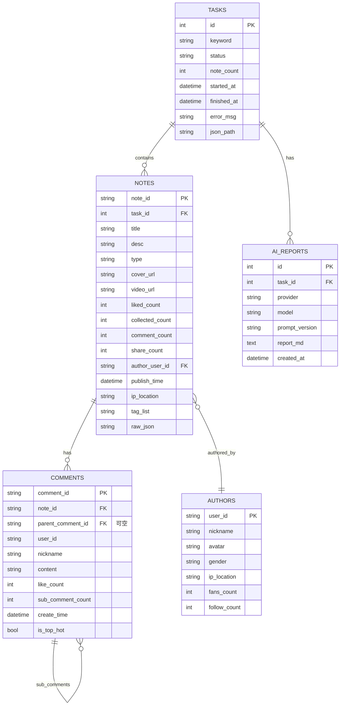

# 设计文档:小红书内容洞察 MVP (xhs-content-insight)

## 概述

`xhs-content-insight` 是一个基于开源项目 [NanmiCoder/MediaCrawler](https://github.com/NanmiCoder/MediaCrawler) 二次封装的小红书内容洞察 MVP。用户在前端输入关键词后,后端通过 `CrawlerService` 调用 MediaCrawler(以 git submodule 形式接入,不修改其源码)采集约 20 条相关笔记,落库到 SQLite 并归档为 JSON 文件;前端提供素材池、笔记详情、评论洞察、AI 分析报告等多个视图。

技术栈:**Python + FastAPI + SQLAlchemy(后端)、SQLite(存储)、React + Vite + TypeScript + Tailwind CSS(前端)、MediaCrawler(爬虫引擎,只调用不修改)**。AI 分析模块 `ai_analyzer.py` 抽象为接口,默认提供 OpenAI / DeepSeek / Gemini 三种 Provider 实现,通过环境变量切换。

本项目仅用于 **学习研究和小规模数据分析**,严格禁止任何自动评论、自动私信、自动发布、批量账号、绕过登录验证或二次分发原始数据等行为(详见「合规与风控边界」章节)。

---

## 高层设计 (High-Level Design)

### 1. 系统架构图

```mermaid
graph TD
    Browser[浏览器]
    subgraph Frontend["前端 (React + Vite + TS + Tailwind)"]
        UI[页面与组件]
        AxiosClient[Axios API Client]
    end
    subgraph Backend["后端 (FastAPI)"]
        APILayer[API Routes<br/>tasks / notes / comments / ai_reports]
        CrawlerSvc[CrawlerService<br/>封装层]
        AIAnalyzer[AIAnalyzer<br/>抽象 + 多 Provider]
        DataStore[DataStore<br/>SQLAlchemy + JSON 归档]
    end
    subgraph ThirdParty["third_party (不修改)"]
        MediaCrawler[MediaCrawler<br/>main.py / xhs client]
    end
    subgraph Storage["本地存储"]
        SQLite[(insight.db<br/>SQLite)]
        JSONArchive[/data/json/{task_id}.json/]
    end
    subgraph LLM["外部 LLM API"]
        OpenAI[OpenAI]
        DeepSeek[DeepSeek]
        Gemini[Gemini]
    end

    Browser --> UI
    UI --> AxiosClient
    AxiosClient -->|REST/JSON| APILayer
    APILayer --> CrawlerSvc
    APILayer --> AIAnalyzer
    APILayer --> DataStore
    CrawlerSvc -->|subprocess / import| MediaCrawler
    MediaCrawler -->|原生输出| CrawlerSvc
    CrawlerSvc --> DataStore
    DataStore --> SQLite
    DataStore --> JSONArchive
    AIAnalyzer -->|HTTPS| OpenAI
    AIAnalyzer -->|HTTPS| DeepSeek
    AIAnalyzer -->|HTTPS| Gemini
    AIAnalyzer --> DataStore
```

关键说明:

- **采集链路**:浏览器 → React 前端 → FastAPI 后端 → CrawlerService 封装层 → MediaCrawler(子进程或 import) → SQLite + JSON 文件存储。
- **AI 分析链路**:作为独立分支,只读 SQLite 中的 notes / comments,生成 markdown 报告写回 `ai_reports` 表,不修改原始数据。
- **爬虫与业务解耦**:MediaCrawler 始终保持原始版本(submodule),所有定制逻辑在 `CrawlerService` 层完成。

### 2. 组件划分

#### 2.1 前端组件

| 类别 | 组件/页面 | 说明 |
| --- | --- | --- |
| 页面 | 首页 `/` | 关键词输入 + 启动采集 + 历史任务列表 |
| 页面 | 任务详情 `/tasks/:taskId` | 进度条、采集概览、跳转入口 |
| 页面 | 素材池 `/tasks/:taskId/notes` | 笔记卡片网格(NoteList + NoteCard) |
| 页面 | 笔记详情 `/tasks/:taskId/notes/:noteId` | 正文 + 作者信息 + 评论树 |
| 页面 | 评论洞察 `/tasks/:taskId/insights` | 高频词 / 词云 / 情感分布 / 热门评论 Top N |
| 页面 | AI 报告 `/tasks/:taskId/report` | Markdown 渲染 + 重新生成按钮 |
| 页面 | 任务管理 `/tasks` | 全量任务列表与状态 |
| 通用 | `KeywordInput` | 关键词输入与限速提示 |
| 通用 | `TaskCard` | 任务概览卡片 |
| 通用 | `NoteCard` | 笔记卡片(封面、标题、互动数) |
| 通用 | `CommentTree` | 一级 + 二级评论树 |
| 通用 | `MarkdownView` | AI 报告渲染 |
| 通用 | `ComplianceBanner` | 全局「仅供研究」提示横幅 |

#### 2.2 后端模块

```
app/
├── main.py                # FastAPI 入口,注册路由、中间件、生命周期
├── api/                   # 路由层(薄,只做参数校验和编排)
│   ├── tasks.py
│   ├── notes.py
│   ├── comments.py
│   └── ai_reports.py
├── services/              # 业务编排
│   ├── crawler_service.py # 封装 MediaCrawler 调用
│   ├── ai_analyzer.py     # AI 分析抽象 + Provider 实现
│   └── data_store.py      # 数据持久化(SQLAlchemy + JSON)
├── models/                # SQLAlchemy ORM 模型
├── schemas/               # Pydantic 请求/响应模型
├── core/                  # 配置、日志、DB Engine
└── utils/                 # 通用工具(限速、Token 计数等)
```

#### 2.3 数据层

- **SQLite (主存储)**:`data/insight.db`,5 张主表:`tasks` / `authors` / `notes` / `comments` / `ai_reports`。
- **JSON 归档**:每次采集任务结束后,把当次的笔记 + 评论快照写入 `data/json/{task_id}.json`,作为历史溯源与断点恢复依据。

### 3. 数据模型(ER 图)



### 4. 调用 MediaCrawler 的策略

为了「不修改源码」这一硬约束,我们考察两种集成方案:

#### 方案 A:子进程方式(推荐用于 MVP)

通过 `subprocess` 启动 `python main.py --platform xhs --type search --keywords <keyword> ...`,等待其执行结束后从 MediaCrawler 自带的 SQLite/JSON 输出读回数据,再转换成本项目模型。

- ✅ 与 MediaCrawler 完全解耦,任何版本升级都不会破坏接口。
- ✅ 进程隔离,爬虫崩溃不会拖垮 FastAPI 主进程。
- ❌ 无法精细控制中间状态(如「采集到第 N 条」)。
- ❌ 进程启动有几百 ms 开销,需要做好任务异步化(BackgroundTasks 或 queue)。

#### 方案 B:作为 Python 模块直接 import

把 `third_party/MediaCrawler` 加入 `sys.path`,直接 `from media_platform.xhs.client import XHSClient`,在 `CrawlerService` 内部用其 client 类发起请求。

- ✅ 可获取实时进度,内存中直接拿到结构化对象。
- ✅ 不需要解析子进程输出。
- ❌ 与 MediaCrawler 内部实现耦合较深,版本升级风险大。
- ❌ 浏览器自动化(Playwright)与 FastAPI 共进程,异常隔离差。

#### 取舍结论

**MVP 阶段采用「方案 A 子进程」** 作为默认实现,接口层 `CrawlerService.run_xhs_search()` 以 async 形式暴露,内部通过 `asyncio.create_subprocess_exec` 启动 MediaCrawler。后续若需要实时进度上报,再切到方案 B 或两者混合,但 `CrawlerService` 的对外接口保持不变。

### 5. 合规与风控边界(红线,严格遵守)

> ⚠️ 本节为硬性约束,所有功能设计与代码实现都必须不违反这些条款。

1. **使用范围**:仅用于 **学习研究** 与 **小规模数据分析**,不做任何商用、转售、对外服务化。
2. **采集规模**:单次采集 **≤ 20 条笔记**,二级评论只取「热门 Top N」,N 默认 ≤ 5。
3. **采集频率**:**固定限速,不并发**。同一时刻全局只允许 1 个采集任务在跑(状态机层面校验)。
4. **禁止行为**(代码层面不实现、UI 层面不暴露入口):
   - 自动评论、自动点赞、自动收藏
   - 自动私信、自动关注/取关
   - 自动发布、批量账号矩阵操作
   - 绕过登录验证、绕过滑块/短信验证
   - 二次分发、对外公开 API、对外公开原始数据
5. **数据存储**:全部 **本地存储**,不上传任何第三方对象存储或公网数据库;`raw_json` 字段中的敏感信息(手机号、绑定邮箱等,如果出现)需在入库前剥离。
6. **服务暴露**:FastAPI 默认只监听 `127.0.0.1`,不对外开放端口;不提供匿名/公开访问的接口。
7. **UI 提示**:所有页面顶部固定 `ComplianceBanner`,文案:「本工具仅供学习研究和小规模数据分析,请遵守平台条款,不得用于自动化营销、批量发布或商业用途」。
8. **审计日志**:每次采集任务记录关键词、时间、采集数量,便于自查与追溯。

---

## 低层设计 (Low-Level Design)

### 1. 完整目录结构

```
xhs-content-insight/
├── backend/
│   ├── app/
│   │   ├── __init__.py
│   │   ├── main.py
│   │   ├── api/
│   │   │   ├── __init__.py
│   │   │   ├── tasks.py
│   │   │   ├── notes.py
│   │   │   ├── comments.py
│   │   │   └── ai_reports.py
│   │   ├── services/
│   │   │   ├── __init__.py
│   │   │   ├── crawler_service.py
│   │   │   ├── ai_analyzer.py
│   │   │   └── data_store.py
│   │   ├── models/
│   │   │   ├── __init__.py
│   │   │   ├── base.py
│   │   │   ├── task.py
│   │   │   ├── note.py
│   │   │   ├── author.py
│   │   │   ├── comment.py
│   │   │   └── ai_report.py
│   │   ├── schemas/
│   │   │   ├── __init__.py
│   │   │   ├── task.py
│   │   │   ├── note.py
│   │   │   ├── comment.py
│   │   │   └── ai_report.py
│   │   ├── core/
│   │   │   ├── __init__.py
│   │   │   ├── config.py
│   │   │   ├── db.py
│   │   │   └── logger.py
│   │   └── utils/
│   │       ├── __init__.py
│   │       ├── rate_limit.py
│   │       └── token_count.py
│   ├── tests/
│   │   ├── __init__.py
│   │   ├── test_crawler_service.py
│   │   ├── test_ai_analyzer.py
│   │   └── test_api.py
│   ├── pyproject.toml
│   └── .env.example
├── frontend/
│   ├── src/
│   │   ├── pages/
│   │   │   ├── Home.tsx
│   │   │   ├── TaskDetail.tsx
│   │   │   ├── NoteList.tsx
│   │   │   ├── NoteDetail.tsx
│   │   │   ├── Insights.tsx
│   │   │   ├── Report.tsx
│   │   │   └── TaskManager.tsx
│   │   ├── components/
│   │   │   ├── KeywordInput.tsx
│   │   │   ├── TaskCard.tsx
│   │   │   ├── NoteCard.tsx
│   │   │   ├── CommentTree.tsx
│   │   │   ├── MarkdownView.tsx
│   │   │   └── ComplianceBanner.tsx
│   │   ├── api/
│   │   │   ├── client.ts
│   │   │   ├── tasks.ts
│   │   │   ├── notes.ts
│   │   │   └── reports.ts
│   │   ├── hooks/
│   │   │   ├── useTasks.ts
│   │   │   └── usePolling.ts
│   │   ├── types/
│   │   │   └── models.ts
│   │   ├── App.tsx
│   │   └── main.tsx
│   ├── index.html
│   ├── tailwind.config.js
│   ├── postcss.config.js
│   ├── vite.config.ts
│   ├── tsconfig.json
│   └── package.json
├── third_party/
│   └── MediaCrawler/        # git submodule,严禁修改
├── data/
│   ├── insight.db           # SQLite 主库(运行时自动生成)
│   └── json/
│       └── {task_id}.json   # 每次任务的归档
├── docs/
│   ├── architecture.md
│   └── compliance.md
├── docker-compose.yml       # 可选,后端 + 前端 dev server
├── .gitignore
├── .gitmodules
└── README.md
```

### 2. SQLite 表结构(完整 DDL)

> 所有时间字段统一为 ISO8601 文本(SQLite 无原生 datetime,SQLAlchemy 透明转换)。`raw_json` 用于存储 MediaCrawler 原始返回,便于后期补字段。

```sql
-- 1) tasks: 采集任务
CREATE TABLE IF NOT EXISTS tasks (
    id           INTEGER PRIMARY KEY AUTOINCREMENT,
    keyword      TEXT    NOT NULL,
    status       TEXT    NOT NULL DEFAULT 'pending'
                 CHECK (status IN ('pending', 'running', 'success', 'failed')),
    note_count   INTEGER NOT NULL DEFAULT 0,
    max_notes    INTEGER NOT NULL DEFAULT 20,
    started_at   TEXT,
    finished_at  TEXT,
    error_msg    TEXT,
    json_path    TEXT,
    created_at   TEXT    NOT NULL DEFAULT (datetime('now'))
);

-- 2) authors: 作者
CREATE TABLE IF NOT EXISTS authors (
    user_id       TEXT PRIMARY KEY,
    nickname      TEXT,
    avatar        TEXT,
    gender        TEXT,
    ip_location   TEXT,
    fans_count    INTEGER DEFAULT 0,
    follow_count  INTEGER DEFAULT 0,
    updated_at    TEXT NOT NULL DEFAULT (datetime('now'))
);

-- 3) notes: 笔记
CREATE TABLE IF NOT EXISTS notes (
    note_id          TEXT PRIMARY KEY,            -- 同一笔记不同 task 也只保留一条主记录
    task_id          INTEGER NOT NULL,
    title            TEXT,
    desc             TEXT,
    type             TEXT CHECK (type IN ('normal', 'video')),
    cover_url        TEXT,
    video_url        TEXT,
    liked_count      INTEGER DEFAULT 0,
    collected_count  INTEGER DEFAULT 0,
    comment_count    INTEGER DEFAULT 0,
    share_count      INTEGER DEFAULT 0,
    author_user_id   TEXT,
    publish_time     TEXT,
    ip_location      TEXT,
    tag_list         TEXT,                        -- JSON 数组字符串
    raw_json         TEXT,                        -- MediaCrawler 原始返回
    created_at       TEXT NOT NULL DEFAULT (datetime('now')),
    FOREIGN KEY (task_id)        REFERENCES tasks(id)        ON DELETE CASCADE,
    FOREIGN KEY (author_user_id) REFERENCES authors(user_id) ON DELETE SET NULL
);
CREATE INDEX IF NOT EXISTS idx_notes_task_id   ON notes(task_id);
CREATE INDEX IF NOT EXISTS idx_notes_author_id ON notes(author_user_id);

-- 4) comments: 评论(一级 + 二级,通过 parent_comment_id 区分)
CREATE TABLE IF NOT EXISTS comments (
    comment_id         TEXT PRIMARY KEY,
    note_id            TEXT NOT NULL,
    parent_comment_id  TEXT,                      -- NULL 表示一级评论
    user_id            TEXT,
    nickname           TEXT,
    content            TEXT,
    like_count         INTEGER DEFAULT 0,
    sub_comment_count  INTEGER DEFAULT 0,
    create_time        TEXT,
    is_top_hot         INTEGER NOT NULL DEFAULT 0 CHECK (is_top_hot IN (0, 1)),
    created_at         TEXT NOT NULL DEFAULT (datetime('now')),
    FOREIGN KEY (note_id)           REFERENCES notes(note_id)        ON DELETE CASCADE,
    FOREIGN KEY (parent_comment_id) REFERENCES comments(comment_id)  ON DELETE CASCADE
);
CREATE INDEX IF NOT EXISTS idx_comments_note_id   ON comments(note_id);
CREATE INDEX IF NOT EXISTS idx_comments_parent_id ON comments(parent_comment_id);
CREATE INDEX IF NOT EXISTS idx_comments_hot       ON comments(note_id, is_top_hot);

-- 5) ai_reports: AI 分析报告
CREATE TABLE IF NOT EXISTS ai_reports (
    id              INTEGER PRIMARY KEY AUTOINCREMENT,
    task_id         INTEGER NOT NULL,
    provider        TEXT    NOT NULL CHECK (provider IN ('openai', 'deepseek', 'gemini')),
    model           TEXT    NOT NULL,
    prompt_version  TEXT    NOT NULL DEFAULT 'v1',
    report_md       TEXT    NOT NULL,
    created_at      TEXT    NOT NULL DEFAULT (datetime('now')),
    FOREIGN KEY (task_id) REFERENCES tasks(id) ON DELETE CASCADE
);
CREATE INDEX IF NOT EXISTS idx_ai_reports_task_id ON ai_reports(task_id);
```

索引设计要点:

- `notes.task_id` —— 素材池页按任务列出。
- `comments.note_id` —— 笔记详情页加载评论。
- `comments.parent_comment_id` —— 构建评论树。
- `comments(note_id, is_top_hot)` —— 评论洞察页快速取热门。
- `ai_reports.task_id` —— 任务下的报告历史。

### 3. 后端 REST API

> Base URL:`http://127.0.0.1:8000/api`
> 所有接口返回 JSON,统一错误结构 `{"code": <int>, "message": <str>, "detail": <any>}`。

#### 3.1 创建采集任务

- `POST /api/tasks`
- 请求体:
  ```json
  { "keyword": "夏季穿搭", "max_notes": 20 }
  ```
- 响应(202):
  ```json
  { "task_id": 12, "status": "pending" }
  ```
- 校验:`max_notes ≤ 20`;同一时刻仅允许 1 个 `running` 任务(否则返回 409)。

#### 3.2 任务列表

- `GET /api/tasks?status=running&limit=20&offset=0`
- 响应:
  ```json
  {
    "items": [
      {
        "id": 12, "keyword": "夏季穿搭", "status": "success",
        "note_count": 20, "started_at": "2025-01-10T10:00:00",
        "finished_at": "2025-01-10T10:02:33"
      }
    ],
    "total": 35
  }
  ```

#### 3.3 任务详情

- `GET /api/tasks/{task_id}`
- 响应:
  ```json
  {
    "id": 12,
    "keyword": "夏季穿搭",
    "status": "success",
    "note_count": 20,
    "max_notes": 20,
    "started_at": "2025-01-10T10:00:00",
    "finished_at": "2025-01-10T10:02:33",
    "error_msg": null,
    "json_path": "data/json/12.json",
    "summary": {
      "total_likes": 123456,
      "total_comments": 3210,
      "top_authors": [{"user_id": "u1", "nickname": "小A", "fans_count": 10000}]
    }
  }
  ```

#### 3.4 任务下的笔记列表(分页)

- `GET /api/tasks/{task_id}/notes?limit=20&offset=0`
- 响应:
  ```json
  {
    "items": [
      {
        "note_id": "abc123", "title": "夏天穿搭灵感", "type": "normal",
        "cover_url": "https://...", "liked_count": 5200, "collected_count": 1200,
        "comment_count": 350, "author": {"user_id": "u1", "nickname": "小A"}
      }
    ],
    "total": 20
  }
  ```

#### 3.5 笔记详情(含作者 + 评论树)

- `GET /api/notes/{note_id}`
- 响应:
  ```json
  {
    "note": {
      "note_id": "abc123", "title": "夏天穿搭灵感", "desc": "...",
      "type": "normal", "cover_url": "...", "video_url": null,
      "liked_count": 5200, "collected_count": 1200, "comment_count": 350,
      "share_count": 80, "publish_time": "2025-01-09T18:30:00",
      "ip_location": "上海", "tag_list": ["穿搭", "夏季"]
    },
    "author": {
      "user_id": "u1", "nickname": "小A", "avatar": "...",
      "gender": "female", "ip_location": "上海",
      "fans_count": 10000, "follow_count": 200
    },
    "comments": [
      {
        "comment_id": "c1", "user_id": "uX", "nickname": "路人甲",
        "content": "好好看", "like_count": 120, "sub_comment_count": 3,
        "create_time": "2025-01-09T19:00:00",
        "sub_comments": [
          {
            "comment_id": "c1-1", "parent_comment_id": "c1",
            "user_id": "uY", "nickname": "路人乙", "content": "同款链接?",
            "like_count": 30, "is_top_hot": true,
            "create_time": "2025-01-09T19:30:00"
          }
        ]
      }
    ]
  }
  ```

#### 3.6 评论聚合(用于评论洞察页)

- `GET /api/tasks/{task_id}/comments`
- 响应:
  ```json
  {
    "total_comments": 3210,
    "top_keywords": [
      {"word": "好看", "count": 152},
      {"word": "同款", "count": 98}
    ],
    "sentiment": { "positive": 0.62, "neutral": 0.30, "negative": 0.08 },
    "top_hot_comments": [
      {
        "comment_id": "c1", "note_id": "abc123",
        "content": "好好看", "like_count": 120, "nickname": "路人甲"
      }
    ]
  }
  ```
  备注:`sentiment` MVP 阶段可由 `ai_analyzer` 离线打分或简单规则给出,前端只渲染。

#### 3.7 触发 AI 报告生成

- `POST /api/tasks/{task_id}/ai-report`
- 请求体:
  ```json
  { "provider": "openai", "model": "gpt-4o-mini" }
  ```
- 响应(202):
  ```json
  { "report_id": 7, "status": "pending" }
  ```

#### 3.8 获取 AI 报告

- `GET /api/ai-reports/{report_id}`
- 响应:
  ```json
  {
    "id": 7, "task_id": 12,
    "provider": "openai", "model": "gpt-4o-mini",
    "prompt_version": "v1",
    "report_md": "# 夏季穿搭 - 内容洞察报告\n## 1. 选题方向 ...",
    "created_at": "2025-01-10T10:05:00"
  }
  ```

#### 3.9 导出 JSON

- `GET /api/tasks/{task_id}/export`
- 响应:`application/json`,直接返回 `data/json/{task_id}.json` 内容,文件名 `task_{task_id}.json`。

### 4. 关键模块伪代码与函数签名

#### 4.1 `crawler_service.py`

```python
# backend/app/services/crawler_service.py
from __future__ import annotations
import asyncio
import json
from dataclasses import dataclass
from pathlib import Path
from typing import List, Optional

from app.core.config import settings
from app.core.logger import logger
from app.services.data_store import DataStore


@dataclass
class CrawlResult:
    task_id: int
    note_count: int
    json_path: str
    error_msg: Optional[str] = None


class CrawlerError(Exception):
    """采集相关异常基类。"""


class LoginExpiredError(CrawlerError):
    """MediaCrawler 登录态失效。"""


class RiskControlError(CrawlerError):
    """命中平台风控。"""


class CrawlerService:
    """封装 MediaCrawler 调用。MVP 默认采用子进程方式。"""

    def __init__(self, store: DataStore) -> None:
        self.store = store
        self.mc_root: Path = settings.MEDIA_CRAWLER_ROOT  # third_party/MediaCrawler
        self.mc_python: str = settings.MEDIA_CRAWLER_PYTHON  # 可单独 venv
        self.timeout_s: int = settings.CRAWL_TIMEOUT_SECONDS  # 默认 600

    async def run_xhs_search(
        self,
        task_id: int,
        keyword: str,
        max_notes: int = 20,
    ) -> CrawlResult:
        """
        前置条件:
            * task_id 在 tasks 表中存在,状态为 pending
            * 0 < max_notes <= 20
            * 全局没有其他任务处于 running

        后置条件:
            * 成功:tasks 表状态变为 success,note_count <= max_notes,
                   notes/comments/authors 已写入,JSON 已归档
            * 失败:tasks 表状态变为 failed,error_msg 非空
            * 无论成功失败,started_at / finished_at 必须填充
        """
        await self.store.mark_task_running(task_id)
        try:
            # 1) 调用 MediaCrawler 子进程
            raw_dir = await self._invoke_subprocess(keyword, max_notes)

            # 2) 读取 MediaCrawler 原生输出(SQLite/JSON)
            raw_notes, raw_comments = self._read_mc_output(raw_dir)

            # 3) 转换 + 写入本项目 SQLite
            await self.store.upsert_authors_from_raw(raw_notes)
            await self.store.upsert_notes(task_id, raw_notes[:max_notes])
            await self.store.upsert_comments(raw_comments)

            # 4) 归档 JSON
            json_path = await self.store.archive_json(task_id)

            await self.store.mark_task_success(
                task_id=task_id,
                note_count=min(len(raw_notes), max_notes),
                json_path=str(json_path),
            )
            return CrawlResult(task_id=task_id, note_count=min(len(raw_notes), max_notes),
                               json_path=str(json_path))

        except LoginExpiredError as e:
            await self.store.mark_task_failed(task_id, f"login_expired: {e}")
            raise
        except RiskControlError as e:
            await self.store.mark_task_failed(task_id, f"risk_control: {e}")
            raise
        except asyncio.TimeoutError:
            await self.store.mark_task_failed(task_id, "timeout")
            raise CrawlerError("MediaCrawler subprocess timeout")
        except Exception as e:
            logger.exception("crawler unexpected error")
            await self.store.mark_task_failed(task_id, f"unexpected: {e}")
            raise CrawlerError(str(e)) from e

    async def _invoke_subprocess(self, keyword: str, max_notes: int) -> Path:
        """启动 MediaCrawler 子进程并等待结束。"""
        cmd = [
            self.mc_python, "main.py",
            "--platform", "xhs",
            "--type", "search",
            "--keywords", keyword,
            "--save_data_option", "db",   # 让 MediaCrawler 输出到它的 sqlite
            "--get_comment", "yes",
            "--get_sub_comment", "yes",
            "--max_notes", str(max_notes),
        ]
        logger.info("spawn MediaCrawler: %s", " ".join(cmd))

        proc = await asyncio.create_subprocess_exec(
            *cmd,
            cwd=str(self.mc_root),
            stdout=asyncio.subprocess.PIPE,
            stderr=asyncio.subprocess.PIPE,
        )
        try:
            stdout, stderr = await asyncio.wait_for(
                proc.communicate(), timeout=self.timeout_s
            )
        except asyncio.TimeoutError:
            proc.kill()
            raise

        if proc.returncode != 0:
            err = stderr.decode("utf-8", errors="ignore")
            if "login" in err.lower():
                raise LoginExpiredError(err[:500])
            if "risk" in err.lower() or "verify" in err.lower():
                raise RiskControlError(err[:500])
            raise CrawlerError(f"MediaCrawler exit {proc.returncode}: {err[:500]}")

        return self.mc_root / "data" / "xhs"

    def _read_mc_output(self, raw_dir: Path) -> tuple[list[dict], list[dict]]:
        """从 MediaCrawler 输出目录读取 notes / comments(原始 dict)。"""
        # MediaCrawler 默认会输出 contents.db / comments.db 等
        # 这里只示意,实际读取逻辑在实现阶段确定
        notes: list[dict] = []
        comments: list[dict] = []
        # ... 读取并 append 到 notes / comments
        return notes, comments
```

**关键算法伪代码:采集主流程**

```pascal
ALGORITHM run_xhs_search(task_id, keyword, max_notes)
INPUT:
    task_id of INTEGER, keyword of STRING, max_notes of INTEGER
OUTPUT:
    result of CrawlResult
PRECONDITION:
    task EXISTS WITH id = task_id
    task.status = 'pending'
    0 < max_notes <= 20
    NOT EXISTS another task WITH status = 'running'
POSTCONDITION:
    task.status IN {'success', 'failed'}
    IF success THEN task.note_count <= max_notes
                AND notes_in_db(task_id) = task.note_count
                AND json_archive_exists(task_id)
    IF failed  THEN task.error_msg IS NOT NULL

BEGIN
    store.mark_task_running(task_id)
    TRY
        raw_dir <- invoke_subprocess(keyword, max_notes)        // 限速、超时
        (raw_notes, raw_comments) <- read_mc_output(raw_dir)

        ASSERT length(raw_notes) <= max_notes

        store.upsert_authors_from_raw(raw_notes)
        store.upsert_notes(task_id, slice(raw_notes, 0, max_notes))
        store.upsert_comments(raw_comments)

        json_path <- store.archive_json(task_id)

        store.mark_task_success(task_id,
                                note_count = min(length(raw_notes), max_notes),
                                json_path = json_path)
        RETURN CrawlResult(task_id, note_count, json_path)
    CATCH LoginExpiredError AS e
        store.mark_task_failed(task_id, "login_expired: " + e.message)
        RAISE
    CATCH RiskControlError AS e
        store.mark_task_failed(task_id, "risk_control: " + e.message)
        RAISE
    CATCH TimeoutError
        store.mark_task_failed(task_id, "timeout")
        RAISE CrawlerError("timeout")
    CATCH Exception AS e
        store.mark_task_failed(task_id, "unexpected: " + e.message)
        RAISE
    END TRY
END
```

**循环不变量(写入笔记的批量循环)**

```pascal
FOR i FROM 0 TO length(raw_notes) - 1 DO
    ASSERT count_of_notes_in_db_for(task_id) = i
    store.upsert_note(task_id, raw_notes[i])
END FOR
ASSERT count_of_notes_in_db_for(task_id) = length(raw_notes)
```

#### 4.2 `ai_analyzer.py`

```python
# backend/app/services/ai_analyzer.py
from __future__ import annotations
import os
from abc import ABC, abstractmethod
from dataclasses import dataclass
from typing import List, Optional

from app.core.config import settings
from app.core.logger import logger
from app.services.data_store import DataStore


@dataclass
class AIReport:
    task_id: int
    provider: str
    model: str
    prompt_version: str
    report_md: str


PROMPT_V1 = """\
你是一名资深内容运营分析师。以下是关于关键词「{keyword}」的小红书笔记与评论摘要。
请输出一份 Markdown 格式的内容洞察报告,包含:
1. 选题方向与高频主题
2. 用户画像与情感倾向
3. 互动数据 Top 笔记拆解
4. 内容创作建议(标题/封面/选题/发布时间)
5. 风险提示(请勿违规营销/虚假宣传)

【素材】
{materials}
"""


class AIAnalyzer(ABC):
    """LLM Provider 抽象。子类只负责真正调用 API。"""

    provider: str = "abstract"

    def __init__(self, store: DataStore, model: str) -> None:
        self.store = store
        self.model = model

    @abstractmethod
    async def _call_llm(self, prompt: str) -> str:
        """实际请求 LLM 的方法,返回 markdown 文本。"""

    async def analyze(self, task_id: int) -> AIReport:
        """
        前置条件:
            * task_id 存在且状态为 success
            * notes / comments 已落库
        后置条件:
            * 不修改 notes / comments / authors / tasks(只读)
            * 在 ai_reports 表插入一条新记录,返回 AIReport
        """
        keyword, notes, comments = await self.store.load_for_ai(task_id)
        materials = self.build_prompt(keyword, notes, comments)
        prompt = PROMPT_V1.format(keyword=keyword, materials=materials)
        logger.info("ai analyze task=%s provider=%s model=%s tokens~=%d",
                    task_id, self.provider, self.model, len(prompt) // 4)

        report_md = await self._call_llm(prompt)

        report = AIReport(
            task_id=task_id,
            provider=self.provider,
            model=self.model,
            prompt_version="v1",
            report_md=report_md,
        )
        await self.store.save_ai_report(report)
        return report

    def build_prompt(self, keyword: str, notes: list, comments: list) -> str:
        """把素材池压缩为 prompt(注意 token 控制)。"""
        # 1) 笔记按 liked_count 降序,取 Top N
        top_notes = sorted(notes, key=lambda n: n.liked_count or 0, reverse=True)[:20]
        # 2) 评论按 like_count 降序,取 Top M
        top_comments = sorted(comments, key=lambda c: c.like_count or 0, reverse=True)[:50]
        # 3) 截断长文本,避免触及 LLM 上下文上限
        lines: list[str] = ["## 笔记 Top"]
        for n in top_notes:
            lines.append(
                f"- [{n.liked_count}赞/{n.comment_count}评] {n.title} | "
                f"{(n.desc or '')[:80]}"
            )
        lines.append("\n## 热门评论 Top")
        for c in top_comments:
            lines.append(f"- [{c.like_count}赞] {(c.content or '')[:120]}")
        return "\n".join(lines)


class OpenAIAnalyzer(AIAnalyzer):
    provider = "openai"

    async def _call_llm(self, prompt: str) -> str:
        # 伪代码:实际使用 openai SDK
        # client = AsyncOpenAI(api_key=os.environ["OPENAI_API_KEY"])
        # resp = await client.chat.completions.create(
        #     model=self.model,
        #     messages=[{"role": "user", "content": prompt}],
        #     temperature=0.4,
        # )
        # return resp.choices[0].message.content
        raise NotImplementedError


class DeepSeekAnalyzer(AIAnalyzer):
    provider = "deepseek"

    async def _call_llm(self, prompt: str) -> str:
        # 伪代码:DeepSeek 兼容 OpenAI 协议,base_url 替换即可
        raise NotImplementedError


class GeminiAnalyzer(AIAnalyzer):
    provider = "gemini"

    async def _call_llm(self, prompt: str) -> str:
        # 伪代码:google-generativeai SDK
        raise NotImplementedError


def make_analyzer(provider: str, model: str, store: DataStore) -> AIAnalyzer:
    """工厂方法。Provider 通过环境变量 + 入参共同决定。"""
    provider = (provider or os.getenv("AI_PROVIDER", "openai")).lower()
    mapping = {
        "openai":   OpenAIAnalyzer,
        "deepseek": DeepSeekAnalyzer,
        "gemini":   GeminiAnalyzer,
    }
    cls = mapping.get(provider)
    if cls is None:
        raise ValueError(f"unsupported provider: {provider}")
    return cls(store=store, model=model)
```

**关键算法伪代码:Prompt 构建(token 控制)**

```pascal
ALGORITHM build_prompt(keyword, notes, comments)
INPUT:
    keyword of STRING, notes of LIST, comments of LIST
OUTPUT:
    prompt of STRING
PRECONDITION:
    notes 和 comments 来自 task.status = 'success' 的任务
    notes 与 comments 在调用过程中只读
POSTCONDITION:
    estimated_tokens(prompt) < MODEL_CONTEXT_LIMIT
    prompt 至少包含 keyword、Top N 笔记标题、Top M 评论文本

BEGIN
    top_notes    <- sort_desc(notes, key = liked_count)[0..N]      // N=20
    top_comments <- sort_desc(comments, key = like_count)[0..M]    // M=50

    lines <- []
    APPEND lines "## 笔记 Top"
    FOR each n IN top_notes DO
        APPEND lines format("- [{0}赞/{1}评] {2} | {3}",
                            n.liked_count, n.comment_count,
                            n.title, truncate(n.desc, 80))
    END FOR

    APPEND lines "## 热门评论 Top"
    FOR each c IN top_comments DO
        APPEND lines format("- [{0}赞] {1}",
                            c.like_count, truncate(c.content, 120))
    END FOR

    prompt <- join(lines, NEWLINE)
    ASSERT estimated_tokens(prompt) < MODEL_CONTEXT_LIMIT
    RETURN prompt
END
```

#### 4.3 `data_store.py`

```python
# backend/app/services/data_store.py
from __future__ import annotations
import json
from contextlib import asynccontextmanager
from datetime import datetime
from pathlib import Path
from typing import Iterable

from sqlalchemy import select
from sqlalchemy.ext.asyncio import AsyncSession, async_sessionmaker

from app.core.config import settings
from app.models import (
    Task, Note, Author, Comment, AIReport,
)


class DataStore:
    """统一管理 SQLAlchemy session、JSON 归档。"""

    def __init__(self, session_maker: async_sessionmaker[AsyncSession]) -> None:
        self._session_maker = session_maker
        self.json_dir: Path = settings.JSON_ARCHIVE_DIR  # data/json
        self.json_dir.mkdir(parents=True, exist_ok=True)

    @asynccontextmanager
    async def session(self):
        async with self._session_maker() as s:
            yield s

    # ---------- task 状态机 ----------
    async def mark_task_running(self, task_id: int) -> None:
        async with self.session() as s:
            t = await s.get(Task, task_id)
            assert t is not None and t.status == "pending"
            t.status = "running"
            t.started_at = datetime.utcnow().isoformat()
            await s.commit()

    async def mark_task_success(self, task_id: int, note_count: int, json_path: str) -> None:
        async with self.session() as s:
            t = await s.get(Task, task_id)
            assert t is not None and t.status == "running"
            t.status = "success"
            t.note_count = note_count
            t.json_path = json_path
            t.finished_at = datetime.utcnow().isoformat()
            await s.commit()

    async def mark_task_failed(self, task_id: int, error_msg: str) -> None:
        async with self.session() as s:
            t = await s.get(Task, task_id)
            assert t is not None and t.status in ("pending", "running")
            t.status = "failed"
            t.error_msg = error_msg[:1000]
            t.finished_at = datetime.utcnow().isoformat()
            await s.commit()

    # ---------- 写入 ----------
    async def upsert_authors_from_raw(self, raw_notes: list[dict]) -> None: ...
    async def upsert_notes(self, task_id: int, raw_notes: list[dict]) -> None: ...
    async def upsert_comments(self, raw_comments: list[dict]) -> None: ...

    # ---------- 归档 ----------
    async def archive_json(self, task_id: int) -> Path:
        async with self.session() as s:
            notes = (await s.execute(
                select(Note).where(Note.task_id == task_id)
            )).scalars().all()
            comments = (await s.execute(
                select(Comment).where(Comment.note_id.in_([n.note_id for n in notes]))
            )).scalars().all()
            payload = {
                "task_id": task_id,
                "exported_at": datetime.utcnow().isoformat(),
                "notes":    [n.to_dict() for n in notes],
                "comments": [c.to_dict() for c in comments],
            }
        path = self.json_dir / f"{task_id}.json"
        path.write_text(json.dumps(payload, ensure_ascii=False, indent=2), encoding="utf-8")
        return path

    # ---------- 读取(供 AI / API) ----------
    async def load_for_ai(self, task_id: int): ...
    async def save_ai_report(self, report) -> int: ...
```

### 5. 前端页面与路由

#### 5.1 路由表

| 路径 | 页面文件 | 关键组件 | 关键交互 |
| --- | --- | --- | --- |
| `/` | `pages/Home.tsx` | `KeywordInput`, `TaskCard` | 输入关键词点击「开始采集」→ `POST /api/tasks` → 跳转 `/tasks/:id`;下方列出最近 10 条历史任务 |
| `/tasks` | `pages/TaskManager.tsx` | `TaskCard` | 全量任务表格,支持按状态筛选 |
| `/tasks/:taskId` | `pages/TaskDetail.tsx` | `TaskCard` + 进度条 | 轮询 `GET /api/tasks/:id`(running 状态每 2s 刷新),显示采集概览,提供「查看素材池/评论洞察/AI 报告」入口 |
| `/tasks/:taskId/notes` | `pages/NoteList.tsx` | `NoteCard`(网格) | 调用 `GET /api/tasks/:id/notes`,卡片显示封面/标题/互动数,点击进 `noteId` |
| `/tasks/:taskId/notes/:noteId` | `pages/NoteDetail.tsx` | `CommentTree` | 调用 `GET /api/notes/:noteId`,渲染正文 + 作者卡 + 评论树(一级展开二级) |
| `/tasks/:taskId/insights` | `pages/Insights.tsx` | 高频词图、热门评论列表 | 调用 `GET /api/tasks/:id/comments`,渲染高频词 / 简单情感分布 / Top 热门评论 |
| `/tasks/:taskId/report` | `pages/Report.tsx` | `MarkdownView` + Provider 切换 | 已有报告则直接渲染;无报告则按钮触发 `POST /api/tasks/:id/ai-report`;支持「重新生成」 |

#### 5.2 通用组件

```typescript
// frontend/src/components/KeywordInput.tsx
interface KeywordInputProps {
  onSubmit: (params: { keyword: string; maxNotes: number }) => void;
  loading?: boolean;
  maxNotesCap?: number; // 默认 20,合规上限
}

// frontend/src/components/NoteCard.tsx
interface NoteCardProps {
  note: NoteSummary;
  onClick?: (noteId: string) => void;
}

// frontend/src/components/CommentTree.tsx
interface CommentTreeProps {
  comments: CommentNode[]; // 一级评论数组,内含 sub_comments
  highlightHot?: boolean;  // 高亮 is_top_hot
}

// frontend/src/components/ComplianceBanner.tsx
//  全局横幅,固定显示在页头,文案见「合规与风控边界」
```

#### 5.3 关键 hooks

```typescript
// frontend/src/hooks/usePolling.ts
function usePolling<T>(
  fn: () => Promise<T>,
  intervalMs: number,
  shouldStop: (data: T) => boolean,
): { data: T | null; loading: boolean; error: Error | null };
// 用于任务详情页轮询任务状态
```

### 6. 第一阶段开发路线图(里程碑)

> 以下为高层里程碑,详细的任务列表会在 `tasks.md` 中正式落地拆分。

| 里程碑 | 内容 | 验收标准 |
| --- | --- | --- |
| **M1 · 项目脚手架 + MediaCrawler 接入** | 创建 backend / frontend / third_party 目录;`MediaCrawler` 以 git submodule 引入;后端 FastAPI hello world 跑通,前端 Vite 跑通,Tailwind 配置 OK | `cd backend && uvicorn app.main:app` 可启;`cd frontend && pnpm dev` 可启;`git submodule status` 看到 MediaCrawler |
| **M2 · CrawlerService 跑通完整链路** | 实现 `CrawlerService.run_xhs_search`,子进程方式调用 MediaCrawler 完成「关键词→20 条笔记」端到端采集 | 命令行触发可拿到 ≥1 条真实笔记数据,异常路径(登录失效/超时)有明确错误码 |
| **M3 · SQLite Schema + 写入 + JSON 归档** | 5 张表 SQLAlchemy 模型 + DDL 脚本;`DataStore` 完成 upsert + archive_json;数据迁移脚本 | 跑一次任务后,sqlite 中能查到 notes/comments;`data/json/{task_id}.json` 存在且结构正确 |
| **M4 · 后端 API 全部联通** | 实现 3.1 ~ 3.9 全部 API;Pydantic schema;统一错误处理 | OpenAPI 文档 `/docs` 列出全部接口;`pytest` 主流程绿灯 |
| **M5 · 前端素材池 + 笔记详情** | Home + TaskDetail + NoteList + NoteDetail 四个页面;`ComplianceBanner` 全局挂载 | 端到端:输入关键词 → 查看素材池 → 点开笔记看到评论树 |
| **M6 · 评论洞察页(基础统计)** | Insights 页;后端 `comments` 聚合接口先用规则法实现高频词与简单情感;词云可后置 | 页面上能看到 Top 高频词、Top 热门评论列表 |
| **M7 · AI 分析模块 + 报告页** | `ai_analyzer.py` 三 Provider 实现;Report 页;Provider 选择;Markdown 渲染 | 至少 1 个 Provider(如 DeepSeek)真实跑通,生成报告并落库 |

### 7. 错误处理(后端)

| 场景 | 触发条件 | 响应 | 恢复策略 |
| --- | --- | --- | --- |
| 任务并发冲突 | 已有任务处于 `running` | HTTP 409,`{"code":"TASK_BUSY"}` | 前端禁用「开始采集」按钮直到上一个任务结束 |
| 关键词为空 | `keyword` 缺失或全空白 | HTTP 422,`{"code":"INVALID_KEYWORD"}` | 前端表单校验 |
| 超出采集上限 | `max_notes > 20` | HTTP 422,`{"code":"OVER_LIMIT"}` | 前端 Input `max=20` |
| MediaCrawler 登录失效 | 子进程 stderr 包含 `login` | task 状态置 `failed`,`error_msg=login_expired` | 提示用户去 MediaCrawler 完成扫码登录后重试 |
| 命中风控 | stderr 包含 `risk`/`verify` | task 状态置 `failed`,`error_msg=risk_control` | 提示用户休息 24h 后再试,**不**自动重试 |
| 子进程超时 | `asyncio.wait_for` 超时 | task 状态置 `failed`,`error_msg=timeout` | 用户手动重试 |
| LLM API 失败 | OpenAI/DeepSeek/Gemini 抛错 | HTTP 502,`{"code":"AI_FAILED"}` | 不写入 `ai_reports`,前端「重新生成」按钮重试 |
| DB 唯一约束冲突 | 重复 `note_id` | upsert 而非 insert,不报错 | 由 DataStore 兜底 |

### 8. 测试策略

#### 8.1 单元测试

- `tests/test_crawler_service.py`:mock 子进程,覆盖成功 / 登录失效 / 风控 / 超时四条路径,断言 task 状态机正确推进。
- `tests/test_ai_analyzer.py`:mock LLM,断言 `build_prompt` 不超 token、Provider 工厂正确分发、`analyze` 不修改原数据。
- `tests/test_api.py`:用 `httpx.AsyncClient` 走 FastAPI ASGI,覆盖 3.1 ~ 3.9。

#### 8.2 属性测试(可选)

- 工具:`hypothesis`。
- 候选属性:
  - 给定任意合法 `notes/comments` 列表,`build_prompt` 输出长度始终 ≤ 配置上限。
  - 给定任意状态机操作序列,task 状态永远只在 {pending, running, success, failed} 内,且不出现回退。

#### 8.3 集成测试

- 一个最小关键词(如 `dog cat unrelated query`)端到端跑一次,验证 SQLite + JSON 都有数据,AI 报告能生成。
- 集成测试 **默认 skip**,通过环境变量 `RUN_E2E=1` 开启,避免在 CI 触发真实平台请求。

### 9. 性能与依赖

#### 9.1 性能考虑

- 单次采集 ≤ 20 条笔记,目标耗时 < 3 分钟(含 MediaCrawler 启动开销)。
- 评论树最多 20 × (一级 + 5 二级) ≈ 几百节点,前端一次性渲染无压力。
- AI Prompt 严格控制在 8K token 以内,避免触及上下文上限。
- SQLite 索引覆盖所有读路径,本地查询都在 ms 级。

#### 9.2 依赖

**后端 `pyproject.toml` 关键依赖**:
- `fastapi`, `uvicorn[standard]`, `pydantic>=2`
- `sqlalchemy>=2`, `aiosqlite`
- `httpx`(LLM 调用)
- `openai`, 可选 `google-generativeai`(按需安装)
- `python-dotenv`
- 测试:`pytest`, `pytest-asyncio`, `hypothesis`

**前端 `package.json` 关键依赖**:
- `react`, `react-dom`, `react-router-dom`
- `vite`, `typescript`, `@vitejs/plugin-react`
- `tailwindcss`, `postcss`, `autoprefixer`
- `axios`
- `react-markdown`, `remark-gfm`(报告渲染)

**第三方**:
- `third_party/MediaCrawler`(git submodule,Apache-2.0,**不修改源码**)

---

## 正确性属性 (Correctness Properties)

> 以下属性会在 `tasks.md` 中转化为单元测试 / 属性测试 / 数据库断言;此处先用形式化语言写出。

1. **note_id 唯一**
   ```math
   ∀ n_1, n_2 ∈ notes : n_1.note\_id = n_2.note\_id ⟹ n_1 = n_2
   ```
   实现:`notes.note_id PRIMARY KEY` + 入库使用 upsert。

2. **评论树结构完整**
   ```math
   ∀ c ∈ comments : c.parent\_comment\_id ≠ NULL ⟹
       ∃ p ∈ comments : p.comment\_id = c.parent\_comment\_id
   ```
   实现:`FOREIGN KEY(parent_comment_id) REFERENCES comments(comment_id)`,且写入时按「先一级、后二级」顺序。

3. **采集数量上限**
   ```math
   ∀ t ∈ tasks : t.note\_count ≤ t.max\_notes ≤ 20
   ```
   实现:API 层校验 `max_notes ≤ 20`;写入 notes 时取 `slice(0, max_notes)`。

4. **AI 报告只读**
   ```math
   ∀ \, before, after \in DB \, snapshots :
       generate\_ai\_report(task\_id) ⟹
       before.notes = after.notes ∧ before.comments = after.comments ∧ before.authors = after.authors
   ```
   实现:`ai_analyzer.analyze` 仅 SELECT,不发起任何 UPDATE/DELETE;通过 SQLAlchemy 只读 session 强约束。

5. **任务状态机单调推进**
   ```math
   \text{允许的转移} \subseteq \{pending → running, running → success, running → failed\}
   ```
   形式化禁止:`success → *`、`failed → *`、`running → pending`、`pending → success` 等。
   实现:`DataStore.mark_task_*` 内部 `assert t.status == 期望前置态`;DB 侧通过 `CHECK (status IN (...))` 约束取值集合。

6. **全局并发限制**
   ```math
   \forall \, t : | \{ x ∈ tasks : x.status = running \} | ≤ 1
   ```
   实现:创建任务前 `SELECT COUNT(*) WHERE status='running'`,> 0 则返回 409。
